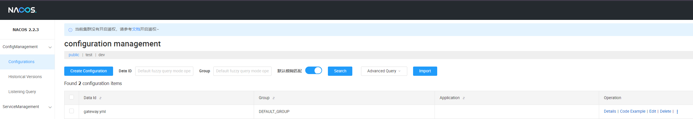
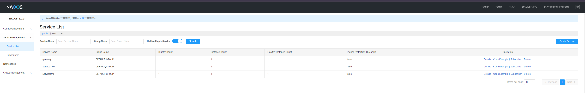

# Spring Gateway and Nacos Service Discovery

This project is to check how to use nacos to achieve  Service Discovery and Dynamic Configuration Management.
A simplified diagram of this demo project:
~~~~

           +-----------------+
           |     Gateway      |
           +-----------------+
                   |
                   v
           +-----------------+
           |  Nacos Server    |
           +-----------------+
            /               \
           v                 v
+----------------+   +----------------+
|   ServiceOne   |   |   ServiceTwo    |
+----------------+   +----------------+

~~~~
- Gateway: The entry point for client requests, which routes requests to the appropriate services.
- Nacos Server: The central service discovery component where all services are registered. The Gateway uses Nacos to discover and route to ServiceOne or ServiceTwo.
- ServiceOne and ServiceTwo: Two microservices registered with Nacos. They are discovered by the Gateway through Nacos.

## Implementation Steps
1. Set up [Nacos](https://nacos.io/en-us/docs/v2/quickstart/quick-start.html) Server. 
   - the default port is [8848](http://localhost:8848/nacos).
   - [video tutorial](https://www.bilibili.com/video/BV1WZ4y1w7ww/?p=2&vd_source=d216e0483cb2bc8d1140b35f1674e41d)
2. Add Dependencies to parent pom.xml.
   ~~~~
   <dependency>
       <groupId>com.alibaba.cloud</groupId>
       <artifactId>spring-cloud-alibaba-dependencies</artifactId>
       <version>2.1.0.RELEASE</version>
       <type>pom</type>
       <scope>import</scope>
   </dependency>
   ~~~~
3. Add Dependencies to micro services
   ~~~~
   <dependency>
       <groupId>com.alibaba.cloud</groupId>
       <artifactId>spring-cloud-starter-alibaba-nacos-discovery</artifactId>
   </dependency>
   ~~~~
4. Rename application.properties to bootstrap.yml and add configurations to gateway:
   ~~~~
   server:
     port: 8090
   spring:
     application:
   name: gateway // will be used in step 5 to configure nacos server
     profiles:
   active: dev
     cloud:
       nacos:
         discovery:
           server-addr: localhost:8848
           locator:
             lower-case-service-id: true
         config:
           server-addr: localhost:8848
           file-extension: yml
           group: DEFAULT_GROUP
           prefix: ${spring.application.name}
           import-check.enabled: false
   ~~~~
5. Configure gateway.yml in Nacos. The configuration file should be in the format of .yml and the name comes from the application name in step 4. 

    ~~~~
    spring:
      cloud:
        gateway:
          routes:
            - id: service1
              uri: lb://ServiceOne
              predicates:
                - Path=/service1/**
              filters:
                - StripPrefix=1
            - id: service2
              uri: lb://ServiceTwo
              predicates:
                - Path=/service2/**
              filters:
                - StripPrefix=1
    ~~~~
4. Enable Discovery Client: Annotate the controller class with @EnableDiscoveryClient to enable service registration and discovery.

Before setup: 
* Service 1: http://localhost:8091/index1
* Service 2: http://localhost:8092/index2
* gateway: http://localhost:8090/gateway

After setup:
Both service 1 and service2 are routing through gateway and can be managed by Nacos.
* Service 1: http://localhost:8090/service1/index1
* Service 2: http://localhost:8090/service2/index2

## Usage
#### Service Registration:
Services like ServiceOne and ServiceTwo will automatically register themselves with Nacos. The gateway will use Nacos to discover these services dynamically, meaning we don't have to hardcode service endpoints in the gateway configuration, enabling microservices to find and communicate with each other dynamically.
####  Service Discovery:
Other microservices can query the Nacos server to find the registered instances of a service. This allows for dynamic service discovery, even in an environment where service instances might be added or removed frequently.
#### Load Balancing: 
Nacos will enable load balancing across multiple instances of a service. If ServiceOne or ServiceTwo is scaled horizontally, the gateway will distribute traffic evenly across all available instances without any additional configuration.
####  Centralized Configuration: 
We can manage the gateway's routes and filters centrally in Nacos. If we need to change a route, add a new service, or update filtering rules, we can do so directly in Nacos without redeploying the gateway.
####  Dynamic Updates: 
Changes made in Nacos are propagated to the gateway in real-time. For example, if we update the routing configuration in Nacos, the gateway will automatically pick up the changes without needing a restart.
### Monitoring and Management:
Use the Nacos console to monitor registered services, their health status, and perform management tasks like deregistration.

## Reference
Dynamic routing with Gateway
* [video](https://www.bilibili.com/video/BV1WV411L7xP/?spm_id_from=333.337.search-card.all.click&vd_source=d216e0483cb2bc8d1140b35f1674e41d)
* [blog](https://blog.csdn.net/nyist_zxp/article/details/131865180)
* [other resources](https://blog.51cto.com/u_10535186/5382540#4nacos_99)
